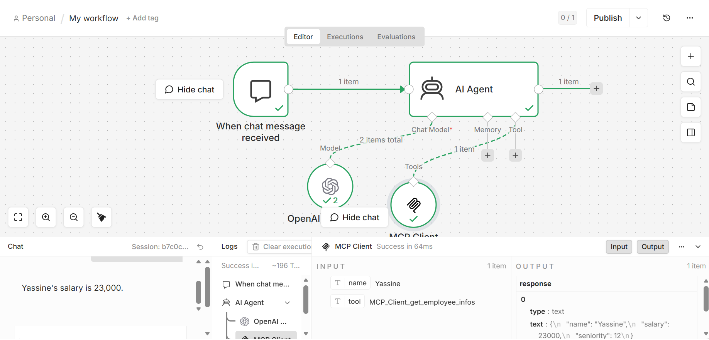

# MCP Agent with n8n Integration

A powerful **Model Context Protocol (MCP)** server that provides intelligent tools for employee information lookup and web search capabilities, integrated with **LangChain** and **n8n** for enterprise automation workflows.

## 🎯 Project Overview

This project demonstrates a complete MCP implementation with:
- **FastMCP Server**: Exposes tools for employee lookup and web search (powered by Tavily)
- **LangChain Agent**: AI-powered agent that uses OpenAI's GPT-4 to interact with MCP tools
- **n8n Integration**: Workflow automation platform connected to the MCP server for enterprise use cases
- **Streamable HTTP Transport**: Modern HTTP-based communication between n8n and MCP

## 🏗️ Architecture

```
┌─────────────────────────────────────────────────────────┐
│                      n8n Workflow                        │
│              (Workflow Automation Platform)              │
└─────────────────────────────────────────────────────────┘
                          ↓ (HTTP)
┌─────────────────────────────────────────────────────────┐
│                    MCP Server (Port 24000)               │
│                  FastMCP with streamable-http            │
├─────────────────────────────────────────────────────────┤
│  Tools:                                                  │
│  • get_employee_infos(name) - Employee lookup            │
│  • search(query) - Web search via Tavily API             │
└─────────────────────────────────────────────────────────┘
                          ↓
┌─────────────────────────────────────────────────────────┐
│                    LangChain Agent                       │
│              (GPT-4 Mini with Tool Calling)              │
└─────────────────────────────────────────────────────────┘
```

## 🚀 Features

- **Employee Information Tool**: Retrieve employee details by name
- **Web Search Tool**: Search the web using Tavily API for real-time information
- **AI Agent**: Intelligent LangChain agent that decides which tools to use based on queries
- **n8n Compatible**: Ready to integrate with n8n workflows for enterprise automation

## 📋 Prerequisites

- **Python**: 3.13 or higher
- **Node.js**: v24.0 or higher
- **API Keys**:
  - OpenAI API key
  - Tavily API key

## 🔧 Installation

### 1. Clone the Repository
```bash
git clone https://github.com/ibtyssam/n8n.git
cd n8n
```

### 2. Set Up Python Environment
```bash
# Using Python venv
python -m venv .venv

# Activate virtual environment
# On Windows:
.venv\Scripts\Activate.ps1

# On macOS/Linux:
source .venv/bin/activate
```

### 3. Install Dependencies
```bash
# Using uv (recommended)
uv install -e

# Or using pip
pip install -e .
```

### 4. Configure Environment Variables
Create a `.env` file in the project root:
```bash
OPENAI_API_KEY=your_openai_api_key_here
TAVILY_API_KEY=your_tavily_api_key_here
```

## 🏃 Running the Project

### Option 1: Start MCP Server Only
```bash
python mcp-server.py
```
The server will start on `http://127.0.0.1:24000/mcp`

### Option 2: Run LangChain Agent
```bash
python agent_graph.py
```
Interactive chat with the AI agent. Type queries and the agent will use MCP tools as needed.

### Option 3: Use with n8n
1. Start the MCP server: `python mcp-server.py`
2. Launch n8n: `corepack pnpm exec n8n start`
3. Access n8n at `http://localhost:5678`
4. Create workflows that connect to MCP at `http://127.0.0.1:24000/mcp`

## 📁 Project Structure

```
.
├── mcp-server.py           # FastMCP server with tools
├── agent_graph.py          # LangChain agent client
├── graph.ipynb             # Jupyter notebook for exploration
├── main.py                 # Main entry point
├── pyproject.toml          # Project configuration and dependencies
├── .env                    # Environment variables (not committed)
└── README.md               # This file
```

## 🛠️ Core Files

### mcp-server.py
FastMCP server providing two tools:
- `get_employee_infos(name)`: Returns mock employee data
- `search(query)`: Performs web search using Tavily

### agent_graph.py
LangChain agent that:
- Connects to the MCP server via streamable-http transport
- Uses GPT-4 Mini for intelligent tool selection
- Processes user queries interactively

## 📊 Execution Example



## 🔗 MCP Server Configuration

When connecting n8n or other clients to the MCP server:
- **URL**: `http://127.0.0.1:24000/mcp`
- **Transport**: Streamable HTTP
- **Host**: 0.0.0.0
- **Port**: 24000

## 🐛 Known Issues

- n8n v2.18.5 has an OpenAI credential test bug related to Axios headers handling. This doesn't affect workflow runtime but may show as a test failure. Consider upgrading n8n for a fix.

## 📦 Dependencies

| Package | Version | Purpose |
|---------|---------|---------|
| langchain | >=1.2.15 | AI framework |
| langchain-openai | >=1.2.0 | OpenAI integration |
| langchain-tavily | >=0.2.18 | Web search tool |
| mcp[cli] | >=1.27.0 | Model Context Protocol |
| langchain-mcp-adapters | >=0.2.2 | LangChain-MCP bridge |
| python-dotenv | >=1.2.2 | Environment management |


